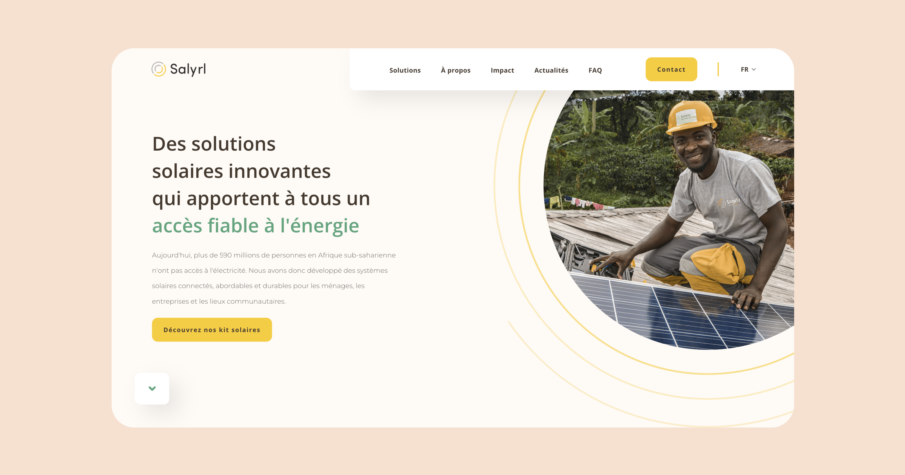

# Atelier design - Test

Le projet a été réalisé avec html, sass et javascript.

## ✨ To do :
- Ajouter des animations : Scroll Reveal dans chaque section et illustration en section avantages.
- Fixer scroll dans le menu mobile.
- Améliorer le desing responsive.
- Améliorez paddings, margins, et responsive design la fonction cal().
- Améliorez la position de l'illustration avec des cercles dans la section des avantages.

